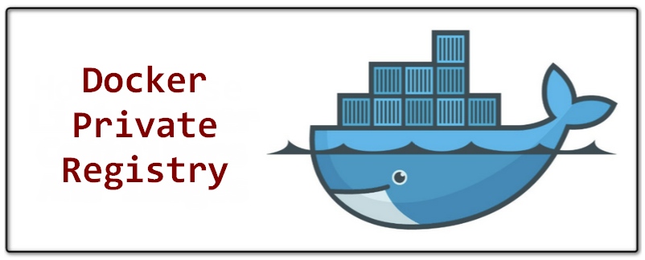

<h1 align="center"> Private Registry Docker </h1>

<p align="center">
  
  
</p>

<p align="center">
  
</p>

## 🌱 Project

- Laboratório para teste do `Private Docker Registry` com autenticação e certificado autoassinado.

## ✨ Tecnologias

- Docker
- Ansible
- Vagrant
- Virtualbox
- Certs self-signed

## 🛠️ Etapas serem feitas

1. [x] [Instalação dos pré-requisitos](./requirements.txt)
    - [x] Ansible
    - [x] Vagrant
    - [x] Virtualbox
2. [x] [Criar um `Vagrantfile` para subir a vm do registry](./Vagrantfile)
3. [x] Configurações iniciais do Ansible
    - [x] [Criar arquivo `ansible.cfg`](./ansible.cfg)
    - [x] [Criar arquivo inventory](./inventory/virtualbox.yml)
4. [x] Criar role para configuração inicial do Host
    - [x] [Instalação do docker](./roles/configure_docker/tasks/main.yml)
    - [x] [Gerenciamento de usuários](./roles/configure_docker/tasks/main.yml)
5. [x] Criar role para configuração do Registry
    - [x] [Criar usuários e senhas para autenticação no registry](./roles/configure_registry/defaults/main.yml)
    - [x] [Gerar certificados self-signed (crt, key e csr)](./roles/configure_registry/tasks/certificates.yml)
    - [x] [Subir container do docker registry](./roles/configure_registry/tasks/registry.yml)
6. [x] [Criar playbook para chamar as roles](./site.yml)

## ✨ Execução

- Instalação dos pré-requisitos
```bash
make init
```

- Subir e configurar todo ambiente de teste
```bash
make setup_up
```

- Derrubar todo ambiente
```bash
make setup_down
```

## 📄 Licença
Esse projeto está sob a licença MIT. Veja o arquivo [LICENSE](LICENSE) para mais detalhes.

## 🙇 Referências